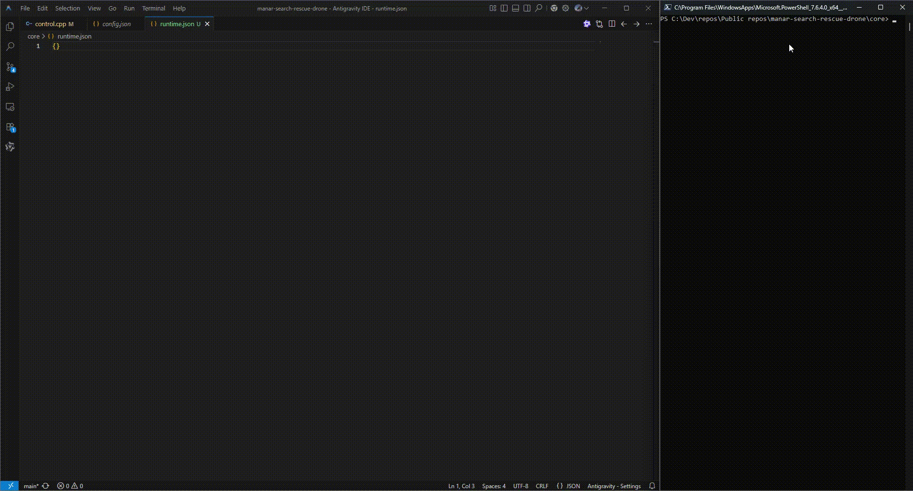

<div align="center">

  

# MANAR / منار

**Supervised-Autonomy Multisensor Search-and-Rescue System**

[](LICENSE.md)
[](core/)
[](gui/)
[](gui/)
[](core/)
[](core/)
[](https://iamoumaribrahim.github.io/manar-search-rescue-drone/)

</div>


> **PROPRIETARY BY DEFAULT · SELECTED COMPONENTS MAY BE OPEN-SOURCED WHEN EXPLICITLY MARKED**
>
> MANAR is independently created and owned by **Oumar Ibrahim**.
> Unless explicitly licensed otherwise, all source code, engineering material,
> algorithms, documentation, and project assets in this repository are proprietary.

### Component Overview

<p align="center">
  
  <br />
  <em>MANAR Multisensor System Component Overview</em>
</p>

| Component              | Primary role                       |
| ---------------------- | ---------------------------------- |
| **Thermal**            | Person/heat detection              |
| **RGB/day**            | Daytime detection/verification     |
| **Low-light/IR**       | Night visual confirmation          |
| **24 GHz FMCW**        | Presence, range, motion, breathing |
| **Speaker + mic**      | Prompt, listen, direction finding  |
| **Passive RF**         | Detect/correlate device emissions  |
| **Amber beacon**       | 360° visual alert                  |
| **White strobe**       | Directional visual guidance        |
| **Downward spotlight** | Close-range illumination           |
| **Heliograph mirrors** | Passive daylight signaling         |
| **Smoke marker**       | Location/wind marking              |

## Current Status
> **Current phase:** Defining engineering requirements.

<p align="center">
  
</p>

## Try It Yourself!

Clone MANAR, build the prototype, then launch the control core and operator terminal:

```powershell
git clone https://github.com/IamOumarIbrahim/manar-search-rescue-drone.git
cd manar-search-rescue-drone/core

mkdir build

g++ apps/control.cpp system/shared.cpp system/flight.cpp system/components.cpp system/drone.cpp system/mission.cpp system/route_optimizer.cpp -I. -Ithird_party -o build/control.exe
g++ apps/terminal.cpp -I. -Ithird_party -o build/terminal.exe
g++ apps/setup.cpp -I. -Ithird_party -o build/setup.exe

.\build\setup.exe
start .\build\control.exe
start .\build\terminal.exe
```

## Project Milestones

> Established:

- [x] Initial ideation & system specification
- [x] GitHub repository setup & project licensing
- [x] Brand visual identity & asset guidelines
- [x] Scope definition & operational constraint hardening
- [x] Prototype web dashboard (v1.0) & landing page
- [x] Deterministic C++ control-system prototype
- [x] JSON command, runtime & configuration system
- [x] `setup.exe` configuration utility
- [x] Decoupled operator terminal from control logic
- [x] Modularized control, mission, flight, drone & component systems
- [x] Split system classes into header & implementation files
- [x] Restructured core directories
- [x] Structured subsystem & event logging
- [x] Multiple named configuration slots with active-slot selection
- [x] Configurable flight modes & payload state control
- [x] Battery monitoring, battery-save behavior & emergency RTL/landing logic
- [x] Mission-owned RTL behavior & return-to-home navigation
- [x] Deterministic search-area lawnmower navigation
- [x] Mission reset while preserving physical aircraft state
- [x] Explicit mission destination configuration
- [x] Batch payload component control
- [x] Ordered multi-location search planning & autonomous sequential area progression

> Next steps:

- [ ] Define MANAR V1 engineering & mission requirements
- [ ] Research and select candidate hardware components
- [ ] Establish payload mass, power & interface budgets
- [ ] Validate aircraft physical feasibility & propulsion requirements
- [ ] Freeze MANAR V1 simulated aircraft configuration
- [ ] Define component, power & communication architecture
- [ ] Build deterministic C++ component subsystem
- [ ] Expand deterministic flight & mission simulation engine
- [ ] Model aircraft flight dynamics & simulated sensor behavior
- [ ] Create dimensionally grounded 3D drone model in Blender
- [ ] Develop TypeScript / React Operator GUI
- [ ] Integrate TypeScript GUI with C++ Control Core
- [ ] Develop Python / PyTorch perception pipeline
- [ ] Develop multisensor detection & fusion logic
- [ ] Integrate Python ML pipeline with C++ Control Core & GUI
- [ ] Train, evaluate & validate perception models
- [ ] Perform end-to-end simulated mission testing
- [ ] TBD
- [ ] Complete LaTeX report, presentation & technical documentation
- [ ] Produce final demonstration & portfolio material
- [ ] Final public launch & repository maintenance


## Ownership and License

Copyright © 2026 Oumar Ibrahim. All rights reserved.

Unless explicitly stated otherwise, all materials in this repository are
proprietary and governed by the MANAR Proprietary Software and Materials License.

Selected files, components, or directories may be released under separate
open-source licenses. Any such license applies only to the material explicitly
identified as being covered by it.

See the See the [LICENSE](LICENSE.md) and any applicable file or directory license notices for
the complete terms.

