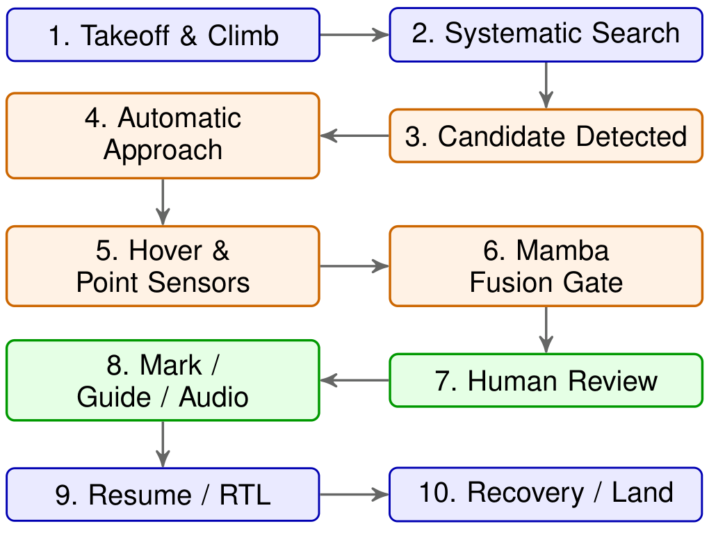
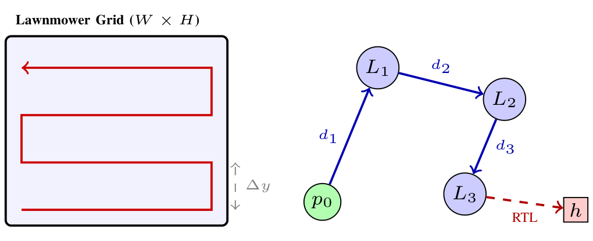

<div align="center">

  

# MANAR / منار

**Supervised-Autonomy Multisensor Search-and-Rescue System**

[](LICENSE.md)
[](core/)
[](core/)
[](https://iamoumaribrahim.github.io/manar-search-rescue-drone/)

</div>


> **PROPRIETARY BY DEFAULT · SELECTED COMPONENTS MAY BE OPEN-SOURCED WHEN EXPLICITLY MARKED**
>
> MANAR is independently created and owned by **Oumar Ibrahim**.
> Unless explicitly licensed otherwise, all source code, engineering material,
> algorithms, documentation, and project assets in this repository are proprietary.

<h2 align="center">Component Overview</h2>

<p align="center">
  
  <br />
  <em>MANAR Multisensor System Component Overview</em>
</p>

### Multisensor System Components

| Component | Primary Role |
| :--- | :--- |
| **Thermal** | Person/heat detection |
| **RGB/day** | Daytime detection/verification |
| **Low-light/IR** | Night visual confirmation |
| **24 GHz FMCW** | Presence, range, motion, breathing |
| **Speaker + mic** | Prompt, listen, direction finding |
| **Passive RF** | Detect/correlate device emissions |
| **Amber beacon** | 360° visual alert |
| **White strobe** | Directional visual guidance |
| **Downward spotlight** | Close-range illumination |
| **Heliograph mirrors** | Passive daylight signaling |
| **Smoke marker** | Location/wind marking |

### Repository Map

| Directory / File | Description |
| :--- | :--- |
| [`core/`](core/) | Deterministic C++ control system |
| [`computer_vision/`](computer_vision/) | Visual detection, models, and benchmarks |
| [`paper/`](paper/) | LaTeX technical paper |
| [`manar-landing-page/`](manar-landing-page/) | Project website |
| [`assets/`](assets/) | Branding, images, and demonstration media |
| [`DEVLOG.md`](DEVLOG.md) | Development decisions & progress |
| [`SECURITY.md`](SECURITY.md) | Security policy |
| [`LICENSE.md`](LICENSE.md) | Licensing terms |

### Key Architectural Decisions

| Name | Why? |
| :--- | :--- |
| **YOLO11n** | ~29.2 ms CPU latency (~1.73× faster than D-FINE-N), 0 false positives on terrain clutter, and minimal SWaP (~2.6M params) for real-time person detection. |
| **Mamba SSM** | Linear $O(L)$ sequence complexity (vs quadratic Transformers) for real-time temporal fusion across 10 Hz multi-sensor feature windows (2–5 s) as an alert gate. |
| **Greedy Algorithm** | Fast, deterministic $O(n^2)$ waypoint sequencing ensuring predictable lawnmower search paths and instant dynamic replanning. |
| **1D CNN Camera Feed** | Compresses high-dimensional 2D detections into compact 1D visual embeddings for low-overhead alignment with audio, radar, and RF streams in the fusion bus. |
| **Two-Level Passive RF** | Level 1 CFAR dynamically triggers on RF anomalies without fixed thresholds; Level 2 evaluates signal derivative trends ($\Delta S_k$: HOT / STABLE / COLD) across previous samples without bulky AoA hardware. |
| **Multi-Tiered Telemetry** | Adaptive rate-tiered policy (1–2 Hz baseline, 5 Hz proximity, on-change state broadcasts, immediate event escalation) to minimize radio power consumption and avoid link saturation while preserving critical situational awareness. |

---

## Multimodal Sensing & Target Verification

<p align="center">
  
  <br />
  <em>Synchronized Day RGB, Low-Light IR, and Long-Wave Thermal (LWIR) target verification across diurnal and environmental extremes.</em>
</p>

---

## Fig. 2. Conceptual 10-stage search, verification, and rescue lifecycle.

MANAR coordinates flight execution through a modular navigation hierarchy and deterministic mission logic.

<p align="center">
  
  <br />
  <em>Fig. 2. Conceptual 10-stage search, verification, and rescue lifecycle.</em>
</p>

---

## Perception & Sensor-Fusion Pipeline

Synchronized feature vectors $\mathbf{x}_t \in \mathbb{R}^D$ sampled at $10\text{ Hz}$ across $20\text{--}50$ time steps ($2\text{--}5\text{ s}$ window) are evaluated by a Mamba State Space Model (SSM). Mamba acts strictly as an alert escalation filter (Reject candidate, Continue verification, or Alert operator), while final rescue determination is reserved exclusively for the human operator.

<p align="center">
  
  <br />
  <em>Fig. 5. Planned multisensor perception and Mamba hover verification pipeline.</em>
</p>

---

## Fig. 3. Spatial geometry: Lawnmower sweep coverage pattern (left) and sequential greedy route progression with RTL return leg (right).

When operators specify multiple search sectors, MANAR executes an $O(n^2)$ greedy nearest-neighbor route optimizer to minimize travel transit distance, combined with systematic lawnmower sweeps.

<p align="center">
  
  <br />
  <em>Fig. 3. Spatial geometry: Lawnmower sweep coverage pattern (left) and sequential greedy route progression with RTL return leg (right).</em>
</p>

---

## System Demonstrations

> **Current status:** Hardware component sizing, React Operator GUI, and downstream multisensor fusion interface.

<div align="center">

### Autonomous Flight Core & Lawnmower Search

<br/><br/>

### YOLO11n Real-Time Target Detection


</div>

## Try It Yourself!

> **Requirements:** Windows 10/11 (or Linux/macOS with C++17 support), MinGW-w64 / GCC (`g++`).

Follow these steps to compile the prototype, configure the aircraft parameters, and launch the interactive operator terminal:

### 1. Build the System

Open PowerShell or terminal in the repository root and compile all core binaries:

```pwsh
# Navigate to core
cd core

# Create build directory
mkdir -p build

# Compile Control Core, Operator Terminal, and Setup Utility
g++ -std=c++17 apps/control.cpp system/shared.cpp system/flight.cpp system/components.cpp system/drone.cpp system/mission.cpp system/route_optimizer.cpp -I. -Ithird_party -o build/control.exe
g++ -std=c++17 apps/terminal.cpp -I. -Ithird_party -o build/terminal.exe
g++ -std=c++17 apps/setup.cpp -I. -Ithird_party -o build/setup.exe
```

### 2. Pre-Flight Configuration (Optional)

Configure active slot settings, custom homebase coordinates, flight limits, or battery-save thresholds:

```pwsh
.\build\setup.exe
```

### 3. Launch the Control Core & Operator Terminal

In **Terminal 1**, start the background flight control engine:
```pwsh
.\build\control.exe
```

In **Terminal 2**, open the interactive operator command station:
```pwsh
.\build\terminal.exe
```


---

### 4. Interactive Operator Walkthrough (Full Experience)

Once the terminal is running, you can execute a full search-and-rescue mission simulation:

1. **Set Search Locations (`Option 1`)**:
   - Enter multiple GPS waypoints (e.g. `25.336421, 55.344471`, `25.338500, 55.346200`, `25.341200, 55.348100`), then type `F` to finish.
   - Choose `Y` to enable automated route optimization (greedy O(n²) solver).
2. **Start Mission (`Option 2`) & Launch Drone (`Option 4`)**:
   - Locks the search plan and initiates takeoff and autonomous lawnmower search progression.
3. **Inspect Real-Time Telemetry (`Option 3`)**:
   - View formatted `runtime.json` live telemetry: GPS coordinates, altitude, battery percentage, flight mode, and active waypoint.
4. **Configure Payload & Sensors (`Option 6`)**:
   - Dynamically toggle individual or batch sensors/actuators (e.g., Thermal camera, 24 GHz FMCW radar, 360° Amber beacon, White strobe, Downward spotlight).
5. **Adjust Flight Mode & Altitude (`Option 5`)**:
   - Switch between flight modes (`Quick`, `Active`, `Inspect`, `Hover`) or update flight altitude on the fly.
6. **Target Detection & Confirmation (`Option 7` / `Option 8`)**:
   - Confirm rescuee detection and transmit exact coordinates to ground rescue dispatch.
7. **Return-to-Launch (`Option 0`)**:
   - Command manual RTL, or allow automatic battery-reserve RTL protection to bring the drone back to base.

---

## Project Milestones

###  1. System Architecture & Foundation
> - [x] Initial ideation & system specification
> - [x] GitHub repository setup & proprietary licensing
> - [x] Brand visual identity & design system
> - [x] Scope definition, operational constraints & safety hardening
> - [x] Core directory restructuring & modular code organization

###  2. Autonomous Flight & C++ Control Core (`core/`)
> - [x] Deterministic C++ control-system engine
> - [x] Decoupled operator terminal & `setup.exe` interactive configuration utility
> - [x] JSON command, runtime snapshot, and configuration management
> - [x] Named configuration slots (Slots 1–3) with active-slot selection
> - [x] Configurable flight modes (`Quick`, `Active`, `Inspect`, `Hover`)
> - [x] Batch payload component control & state management
> - [x] Battery monitoring, battery-save mode & emergency RTL/landing logic
> - [x] Mission-owned return-to-home navigation & state preservation
> - [x] Deterministic lawnmower search navigation
> - [x] Multi-location search planning with greedy O(n²) route optimization
> - [x] Structured subsystem & event logging
- [ ] Expanded flight dynamics & simulated sensor physics engine

###  3. Computer Vision & Multisensor Fusion (`computer_vision/`)
> - [x] Evaluated and benchmarked detector models (YOLO11n vs D-FINE-N) across SAR video datasets
> - [x] Integrated locked YOLO11n ONNX inference engine (~29 ms CPU latency / 34 FPS)
- [ ] Design Python / PyTorch multisensor fusion module interfacing with C++ core
- [ ] Implement multi-object candidate tracking (MOT / ByteTrack) & spatial GPS projection
- [ ] Implement multisensor detection & fusion logic (Thermal + RGB + 24 GHz FMCW radar + RF anomalies + Audio DF)

###  4. Operator Interface & Ground Station
> - [x] Prototype web dashboard (v1.0) & project landing page
- [ ] Modern TypeScript / React Operator GUI
- [ ] Low-latency WebSocket telemetry & bi-directional command bridge with C++ core

###  5. Hardware Engineering & Physical Modeling
- [ ] Ground hardware specs (payload mass, power draw, dimensions) in real components
- [ ] Calculate propulsion thrust-to-weight and battery capacity for 1-hour active search budget
- [ ] Create dimensionally grounded 3D drone airframe & sensor gimbal model in Blender

###  6. Verification, Documentation & Public Release
- [ ] End-to-end simulated search-and-rescue mission validation
- [ ] LaTeX technical paper, presentation deck & comprehensive documentation
- [ ] Produce final demonstration media & portfolio showcase
- [ ] Final public launch & repository release


## Ownership and License

Copyright © 2026 Oumar Ibrahim. All rights reserved.

Unless explicitly stated otherwise, all materials in this repository are
proprietary and governed by the MANAR Proprietary Software and Materials License.

Selected files, components, or directories may be released under separate
open-source licenses. Any such license applies only to the material explicitly
identified as being covered by it.

See the [LICENSE](LICENSE.md) and any applicable file or directory license notices for
the complete terms.

