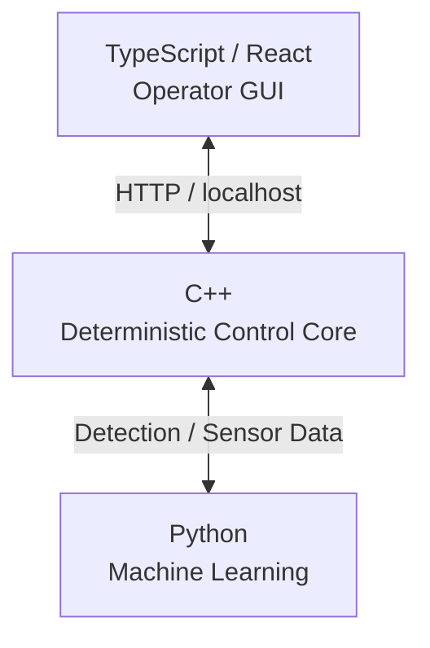

# MANAR / منار

> **PROPRIETARY CORE · SELECTED OPEN-SOURCE COMPONENTS**
>
> MANAR is independently created and owned by **Oumar Ibrahim**.
> This repository contains selected demonstrations, documentation, and
> portfolio materials only.

## Project Overview

MANAR / منار is a supervised-autonomy, multisensor search-and-rescue
drone system designed to assist search teams while keeping consequential
decisions under human supervision.

## Landing Page

<a href="https://iamoumaribrahim.github.io/manar-search-rescue-drone/" target="_blank">MANAR: Supervisied autonomy for search and rescue</a>

### Component Overview

  
   
  <em>MANAR Multisensor System Component Overview</em>

| Component              | Primary role                       |
| ---------------------- | ---------------------------------- |
| **Thermal**            | Person/heat detection              |
| **RGB/day**            | Daytime detection/verification     |
| **Low-light/IR**       | Night visual confirmation          |
| **24 GHz FMCW**        | Presence, range, motion, breathing |
| **Speaker + mic**      | Prompt, listen, direction finding  |
| **Passive RF**         | Detect/correlate device emissions  |
| **Amber beacon**       | 360° visual alert                  |
| **White strobe**       | Directional visual guidance        |
| **Downward spotlight** | Close-range illumination           |
| **Heliograph mirrors** | Passive daylight signaling         |
| **Smoke marker**       | Location/wind marking              |

## Current Status
> **Current phase:** Initial deterministic control system design.

<table>
  <tr>
    <td align="center" width="50%">
      
       
      <em>MANAR Human Control System — Terminal-Based Component Status Interface</em>
    </td>
    <td align="center" width="50%">
      
       
      <em>MANAR Human Control System — High-Level C++ Software Architecture</em>
    </td>
  </tr>
</table>

## Established

  
   
  <em>MANAR Version 1.0 Operator Dashboard — Multisensor Live Feed Interface</em>

## Project Milestones

> - [x] Initial Ideation
> - [x] GitHub Repository creation
> - [x] Initial Branding
> - [x] Project scope hardening
> - [x] Project limitations and constraints
> - [x] Basic web dashboard — v1.0
> - [x] Landing Page
> - [x] Initial deterministic control system design
- [ ] Decouple terminal from control logic
- [ ] Build deterministic controls for components and drone
- [ ] Build the engine control system
- [ ] Build the component controls
- [ ] Test and design final drone configuration
- [ ] Model drone movement in Blender
- [ ] Build the TypeScript GUI
- [ ] Couple the TypeScript GUI with C++ control system
- [ ] Build the Python machine-learning algorithm
- [ ] Couple TypeScript GUI and C++
- [ ] Couple Python ML with TS and C++
- [ ] Test and train models
- [ ] System integration and end-to-end testing
- [ ] To be determined...
- [ ] LaTeX Report, Presentation and Full Documentation
- [ ] Final Publishing & LinkedIn Post
- [ ] Repository Maintenance

## Architecture

**C++** owns system state and deterministic control.
**Python** handles machine learning and sensor analysis.
**TypeScript / React** provides the operator interface.

## Ownership and License

Copyright © 2026 Oumar Ibrahim. All rights reserved.

Unless explicitly stated otherwise, all materials in this repository are
proprietary and governed by the MANAR Proprietary Software and Materials License.

Selected files, components, or directories may be released under separate
open-source licenses. Any such license applies only to the material explicitly
identified as being covered by it.

See the [LICENSE](LICENSE) and any applicable file or directory license notices for
the complete terms.
